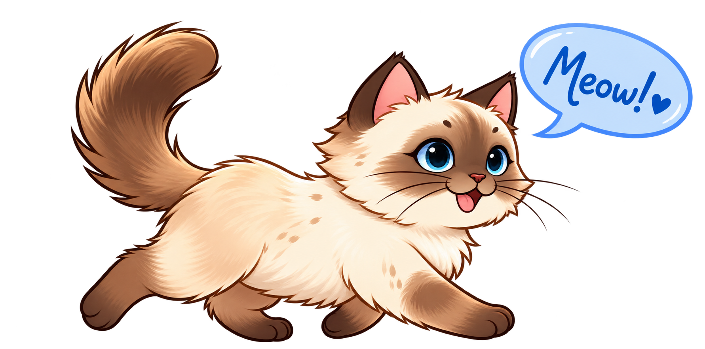

# SemMan4Cat

  
  &nbsp;&nbsp;&nbsp;&nbsp;
  

  <strong>
    A semantic workspace for managing, exploring, querying, and sharing
    research metadata and knowledge graphs
  </strong>

**SemMan4Cat** is a semantic workspace for managing, exploring, querying, and sharing RDF-based research metadata and knowledge graphs.

Developed within **NFDI4Cat**, SemMan4Cat provides a user-oriented layer for working with semantic research data. It combines RDF storage and SPARQL querying with dataset organization, graph exploration, access control, and collaborative data sharing.

Rather than requiring researchers to interact directly with a triple store, SemMan4Cat organizes RDF data into datasets and named graphs and provides interfaces for exploring, querying, managing, and publishing them.

---

## ✨ Main Features

| | Feature | Description |
|---|---|---|
| 📁 | **Dataset and named graph management** | Organize RDF-based research data into datasets and named graphs |
| 📄 | **RDF upload and management** | Upload and manage RDF data within user-defined datasets |
| 🔎 | **SPARQL querying** | Query selected datasets and graphs |
| ▶️ | **Query Studio** | Create, edit, and execute SPARQL queries |
| 🔄 | **Reusable queries** | Save and reuse queries for exploration and analysis workflows |
| 🕸️ | **Graph visualization and exploration** | Interactively explore RDF entities and relationships |
| 👥 | **Access management** | Control access to datasets and individual graphs |
| 🔒 | **Private and shared research workspaces** | Work with research data privately or collaboratively |
| 🌐 | **Public access** | Publish selected datasets and knowledge graphs for public exploration |
| 🔗 | **SPARQL endpoint** | Provide machine-readable access to published semantic data |
| 📥 | **Export** | Export query results and RDF data |
| 🕘 | **Versioning and metadata management** | Manage versions and metadata of research datasets and graphs |

---

## 🔐 Access Modes

SemMan4Cat supports different ways of working with and sharing semantic research data.

| 🔒 **Private** | 🌐 **Public** | 🗄️ **Endpoint** |
|---|---|---|
| Datasets and graphs can remain accessible only to authorized users or collaborators. | Selected datasets and graphs can be made publicly accessible through the SemMan4Cat web interface. | Published semantic data can be accessed programmatically through a SPARQL endpoint. |
| This mode supports ongoing research and internal work before data are ready to be shared or published. | Users can explore published semantic data without directly interacting with the underlying triple store. | This enables machine-readable access and integration with external tools, services, and research workflows. |
| [**Open SemMan4Cat →**](https://semman4cat.nfdi4cat.org/) | [**Explore public data →**](https://semman4cat.nfdi4cat.org/public-explorer) | [**Open SPARQL endpoint →**](https://semman4cat.nfdi4cat.org/endpoint) |

---

## 🔌 Integration with Research Data Services

SemMan4Cat is designed to complement research data repositories and other services in the **NFDI4Cat** infrastructure.

Integration with **Repo4Cat / Dataverse** is currently under development. The goal is to enable RDF files stored in the repository to be opened and explored directly in SemMan4Cat while preserving the repository as the publication and preservation layer.

SemMan4Cat can also receive and work with RDF knowledge graphs generated by other research data management tools, enabling semantic data produced in different workflows to be explored and queried in a common workspace.

---

## 🚀 Try SemMan4Cat

  <strong>
    <a href="https://semman4cat.nfdi4cat.org/">SemMan4Cat</a>
    &nbsp;&nbsp; • &nbsp;&nbsp;
    <a href="https://semman4cat.nfdi4cat.org/public-explorer">Public Explorer</a>
    &nbsp;&nbsp; • &nbsp;&nbsp;
    <a href="https://semman4cat.nfdi4cat.org/endpoint">SPARQL Endpoint</a>
  </strong>

> **Status: active development**
>
> SemMan4Cat is under active development and functionality may still change.  
> Feedback from users and developers of NFDI4Cat services is very welcome.

---

## 🐾 Feedback and Issues

This repository currently serves as the public project page and issue tracker for SemMan4Cat.

Please use [**GitHub Issues**](https://github.com/Juldik0607/SemMan4Cat/issues) if you:

- encounter a bug or unexpected behavior,
- would like to suggest new functionality,
- have an idea for improving an existing feature,
- encounter an interoperability or integration issue,
- or would like to provide other technical feedback.

Two issue templates are available:

- 🐛 **Bug report** — report something that does not work as expected
- 💡 **Feature request** — suggest new functionality or an improvement

---

## 🏛️ About

SemMan4Cat is developed at the **High-Performance Computing Center Stuttgart (HLRS), University of Stuttgart**, within **NFDI4Cat**.

The project focuses on making semantic research data easier to manage, explore, query, share, and integrate across research data management workflows.
